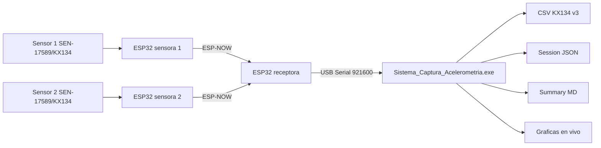

# Sistema de Captura de Acelerometria KX134

Repositorio del prototipo KX134 dual para captura de acelerometria en tiempo real.
El flujo principal actual usa dos sensores SEN-17589/KX134, dos ESP32 sensoras,
una ESP32 receptora, transporte ESP-NOW, salida Serial USB y una aplicacion
Windows empaquetada.

ADXL335 se conserva como flujo historico/legacy para compatibilidad y consulta,
pero ya no es la ruta principal de operacion.

## Estado del proyecto

El prototipo KX134 dual esta funcionalmente completo y listo como release
candidate tecnico. La documentacion de usuario esta preparada, el ejecutable
Windows fue generado y probado visualmente, la sesion controlada de prototipo
fue aprobada, y la baquelada RevA fue completada fisicamente y validada como
funcional por el experto del proyecto.

La baquelada RevA queda aceptada para uso de prototipo. Esto no equivale a
fabricacion industrial repetible: si el cliente requiere produccion, faltaria un
paquete adicional de DFM, BOM final, Gerbers y QA de manufactura.

| Area | Estado |
|------|--------|
| Sensores KX134 | Validado |
| Calibracion Sensor 1/2 | Validada |
| ESP-NOW dual | Validado |
| GUI KX134 | Validada |
| Graficas live | Validadas |
| Exportacion KX134 | Validada |
| Ejecutable Windows | Preparado |
| QA externo visual | Aprobado |
| Prototipo | Listo para entrega funcional |
| Baquelada RevA | Funcional validada |
| Prototipo KX134 | Completo |
| Release candidate | Listo |
| Produccion industrial | Pendiente de QA/DFM si aplica |

## Arquitectura



La PC ejecuta `Sistema_Captura_Acelerometria.exe`. Desde el launcher se puede
abrir el flujo KX134 dual actual o el flujo ADXL335 historico.

## Hardware Validado

| Nodo | Hardware | MAC | Estado |
|------|----------|-----|--------|
| Sensor 1 | ESP32 + SEN-17589/KX134 | `D4:E9:F4:E9:8E:1C` | Validado para GUI/export |
| Sensor 2 | ESP32 + SEN-17589/KX134 | `D4:E9:F4:C3:37:14` | Validado para GUI/export |
| Receptor | ESP32 receptora ESP-NOW a Serial USB | `00:4B:12:96:9A:80` | Validado para GUI/export |

Configuracion validada:

- `sample_rate_hz`: 100.
- `odr_hz`: 100.
- `range_g`: 8.
- `baudrate`: 921600.
- Canal ESP-NOW: 1.

## Aplicacion Windows

El producto empaquetado se distribuye como carpeta onedir de PyInstaller:

- Ejecutable: `Sistema_Captura_Acelerometria.exe`.
- Launcher principal: `gui/app_launcher.py`.
- Flujo actual: KX134 Dual Capture.
- Flujo preservado: ADXL335 historico.

El ejecutable y el ZIP de distribucion son artefactos de build locales y no se
commitean al repositorio.

## Captura y Exportacion

La exportacion KX134 usa contrato CSV v3 y genera:

- CSV raw KX134 v3.
- Session JSON.
- Summary MD.

Reglas actuales del CSV KX134:

- No contiene campos `mv_*`.
- No contiene voltajes ni milivoltios.
- No contiene columnas ADXL335 estimadas.
- No contiene `g_norm` como columna CSV.
- `|g|` puede aparecer solo como visualizacion o resumen, no como columna de
  datos crudos.

## Graficas En Vivo

La GUI KX134 muestra retroalimentacion durante captura:

- `x_g`, `y_g`, `z_g` por sensor.
- Comparacion visual de `|g|`.
- Comparacion del eje seleccionado.
- Eventos/taps visibles para inspeccion operativa.

La visualizacion no modifica datos crudos ni exportacion.

## Estructura Del Repositorio

```text
Repo/
├── firmware/
│   ├── kx134_dual_espnow/          # Firmware actual KX134 dual + receptor
│   ├── kx134_single_node_i2c/      # Firmware de bring-up/calibracion KX134
│   ├── kx134_receiver_identity/    # Identidad MAC de receptor KX134
│   └── dual_node_espnow/           # Legacy ADXL335/ESP-NOW
├── gui/
│   ├── app_launcher.py             # Launcher actual
│   ├── kx134_live_gui.py           # GUI KX134 actual
│   └── adxl_live_gui.py            # GUI ADXL335 historica
├── config/
│   ├── kx134_node_map.json
│   ├── kx134_transport_contract_v3.json
│   └── calibrations/
├── docs/
│   ├── kx134_migration/
│   └── assets/
├── hardware/
│   └── pcb/baquelada_revA/
├── packaging/windows/
├── reports/
├── sistema_captura_acelerometria.spec
├── build_windows_app.ps1
├── adxl_captura.spec              # Legacy ADXL335
└── build_exe.ps1                  # Legacy ADXL335
```

## Uso Rapido

1. Conectar la ESP32 receptora al PC por USB.
2. Alimentar Sensor 1 y Sensor 2.
3. Ejecutar `Sistema_Captura_Acelerometria.exe`.
4. Abrir KX134 Dual Capture.
5. Seleccionar el puerto COM del receptor.
6. Confirmar baudrate `921600`.
7. Definir la duracion.
8. Usar frecuencia esperada `100 Hz` para la configuracion validada.
9. Iniciar captura.
10. Revisar CSV, JSON y summary exportados.

## Desarrollo

Pruebas Python:

```powershell
python -m unittest discover -s tests -p "test_kx134*.py"
python -m unittest discover -s tests -p "test_app_launcher*.py"
```

Compilar GUI y herramientas principales:

```powershell
python -m py_compile gui\kx134_live_gui.py gui\app_launcher.py gui\adxl_live_gui.py
```

Build Windows actual:

```powershell
powershell -ExecutionPolicy Bypass -File .\build_windows_app.ps1 -RunSmoke
```

Validadores utiles:

```powershell
python tools\kx134\validate_kx134_export_bundle.py --help
python tools\kx134\validate_prototype_session.py --help
python tools\kx134\validate_repository_readiness.py --help
```

PlatformIO KX134:

```powershell
$env:PLATFORMIO_EXE="$env:USERPROFILE\.platformio\penv\Scripts\pio.exe"
& $env:PLATFORMIO_EXE run -d .\firmware\kx134_dual_espnow
```

No cargar firmware ni cambiar parametros de captura sin un ticket explicito.

## Documentacion Principal

| Documento | Uso |
|-----------|-----|
| [docs/README.md](docs/README.md) | Indice general del repositorio |
| [docs/kx134_migration/INDEX.md](docs/kx134_migration/INDEX.md) | Indice tecnico KX134 |
| [Guia rapida cliente](docs/kx134_migration/client/QUICK_START_GUIDE.md) | Operacion inicial del prototipo |
| [Manual usuario](docs/kx134_migration/client/USER_MANUAL_KX134_PROTOTYPE.md) | Uso completo del prototipo |
| [Paquete de entrega](docs/kx134_migration/PROTOTYPE_DELIVERY_PACKAGE.md) | Estado de entrega tecnica |
| [Matriz de evidencias](docs/kx134_migration/VALIDATION_EVIDENCE_MATRIX.md) | Evidencia por ticket |
| [Criterios PCB](docs/kx134_migration/PCB_BAQUELADA_CRITERIA.md) | Condiciones antes de PCB |
| [Revision baquelada RevA](hardware/pcb/baquelada_revA/BAQUELADA_REVA_REVIEW.md) | Estado RevA Proteus |
| [Empaquetado Windows](docs/kx134_migration/WINDOWS_PACKAGING_KX134.md) | Build del ejecutable |
| [Troubleshooting cliente](docs/kx134_migration/client/TROUBLESHOOTING_GUIDE.md) | Diagnostico operativo |

## Estado PCB/Baquelada

- Baquelada RevA registrada desde Proteus.
- Estado RevA: `functional_validated_by_expert`.
- Aceptada para uso de prototipo: SI.
- Autoridad de validacion fisica: experto del proyecto.
- No se requiere mas intervencion de CODEX para pruebas fisicas de RevA.
- Si se desea fabricacion repetible, se requiere paquete de manufactura
  adicional: DFM, BOM final, Gerbers y QA de produccion.

## Pendientes Conocidos

- Icono corporativo.
- Firma digital del ejecutable.
- Validacion visual en scaling Windows 125/150.
- Configuracion remota `sample_rate_hz` desde GUI hacia firmware.
- DFM/BOM/Gerbers/QA si se desea fabricacion repetible o produccion industrial.

## Reglas De Repositorio

- No commitear `dist/`, `build_work/`, `.venv/`, `.exe` ni `.zip`.
- No commitear data runtime generada por capturas.
- No modificar calibraciones sin ticket.
- No cambiar `range_g` sin recalibrar.
- No declarar fabricacion industrial lista sin DFM/BOM/Gerbers/QA.
- Registrar cambios relevantes en `reports/change_log.md`.
