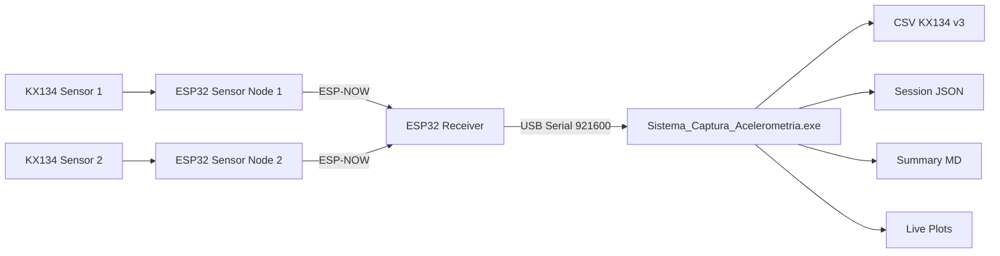

# Arquitectura KX134 Dual

La sincronizacion primaria de eventos se apoya en `receiver_t_us` y secuencias
por sensor. `pc_wall_s` es util para trazabilidad en PC, pero no es la base
primaria para sincronizacion entre nodos.
