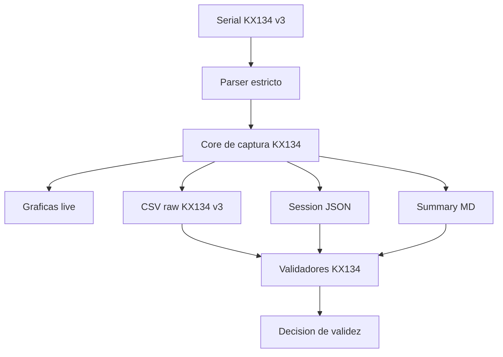

# Flujo De Exportacion KX134

```mermaid
flowchart TD
    STREAM["Serial KX134 v3"] --> PARSER["Parser estricto"]
    PARSER --> CORE["Core de captura KX134"]
    CORE --> LIVE["Graficas live"]
    CORE --> RAW["CSV raw KX134 v3"]
    CORE --> META["Session JSON"]
    CORE --> SUMMARY["Summary MD"]
    RAW --> VALIDATOR["Validadores KX134"]
    META --> VALIDATOR
    SUMMARY --> VALIDATOR
    VALIDATOR --> DECISION["Decision de validez"]
```

La visualizacion live no altera datos crudos ni exportacion. El CSV final no
incluye campos ADXL335, voltajes ni columnas derivadas de norma.
