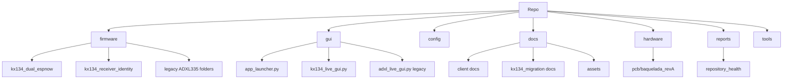

# Estructura Del Repositorio

```mermaid
flowchart TD
    ROOT["Repo"] --> FW["firmware"]
    ROOT --> GUI["gui"]
    ROOT --> CFG["config"]
    ROOT --> DOCS["docs"]
    ROOT --> HW["hardware"]
    ROOT --> REP["reports"]
    ROOT --> TOOLS["tools"]

    FW --> KXFW["kx134_dual_espnow"]
    FW --> KXID["kx134_receiver_identity"]
    FW --> LEGFW["legacy ADXL335 folders"]

    GUI --> LAUNCH["app_launcher.py"]
    GUI --> KXGUI["kx134_live_gui.py"]
    GUI --> ADXLGUI["adxl_live_gui.py legacy"]

    DOCS --> CLIENT["client docs"]
    DOCS --> TECH["kx134_migration docs"]
    DOCS --> ASSETS["assets"]

    HW --> REVA["pcb/baquelada_revA"]
    REP --> HEALTH["repository_health"]
```

Los artefactos de build (`dist/`, `build_work/`, `.venv/`, `.exe`, `.zip`) son
locales y no forman parte del repositorio versionado.
