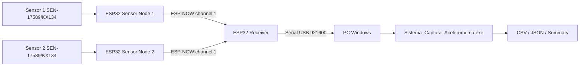

# Arquitectura Del Sistema KX134

## Vista General

## Nodos

| Nodo | MAC | Sensor | Estado |
|------|-----|--------|--------|
| Sensor Node 1 | `D4:E9:F4:E9:8E:1C` | KX134 Sensor 1 | Validado |
| Sensor Node 2 | `D4:E9:F4:C3:37:14` | KX134 Sensor 2 | Validado |
| Receiver | `00:4B:12:96:9A:80` | Ninguno | Validado |

## Configuracion Validada

- `sample_rate_hz`: 100.
- `odr_hz`: 100.
- `range_g`: 8.
- Serial receptor-PC: 921600 baud.

## Flujo De Datos

1. Cada nodo sensor lee su KX134 calibrado.
2. Cada nodo envia paquetes ESP-NOW al receptor.
3. El receptor serializa paquetes KX134 v3 hacia el PC.
4. La GUI parsea, muestra, captura y exporta.

## Contrato KX134 v3

El contrato exige identidad explicita por `sensor_id` y `node_mac`. El receptor
no debe inferir identidades ni aplicar calibraciones compartidas.

`receiver_t_us` es la referencia mas cercana al receptor para comparaciones
temporales entre sensores. `pc_wall_s` se conserva para trazabilidad de la PC y
duracion de sesion, pero no debe usarse como base primaria de sincronizacion
entre nodos.
